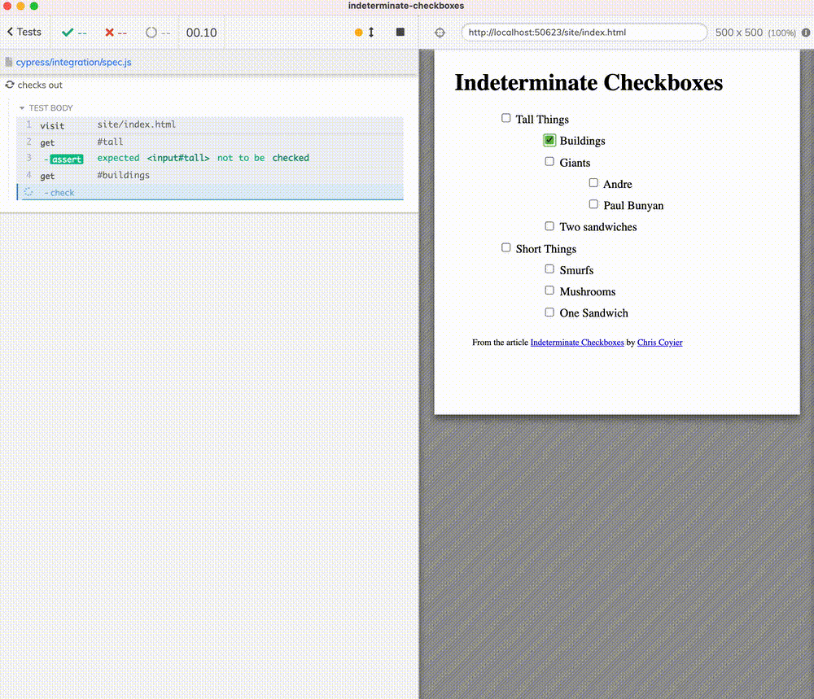

# indeterminate-checkboxes [![renovate-app badge][renovate-badge]][renovate-app]  
> Example testing indeterminate HTML checkboxes using Cypress

See [spec.js](./cypress/integration/spec.js)

Read "Indeterminate Checkboxes" [blog post](https://css-tricks.com/indeterminate-checkboxes/) and watch the [video](https://youtu.be/QHGhp9yG4uw).

## Small print

Author: Gleb Bahmutov &lt;gleb.bahmutov@gmail.com&gt; &copy; 2021

- [@bahmutov](https://twitter.com/bahmutov)
- [glebbahmutov.com](https://glebbahmutov.com)
- [blog](https://glebbahmutov.com/blog)
- [videos](https://www.youtube.com/glebbahmutov)
- [presentations](https://slides.com/bahmutov)
- [cypress.tips](https://cypress.tips)

License: MIT - do anything with the code, but don't blame me if it does not work.

[renovate-badge]: https://img.shields.io/badge/renovate-app-blue.svg
[renovate-app]: https://renovateapp.com/
